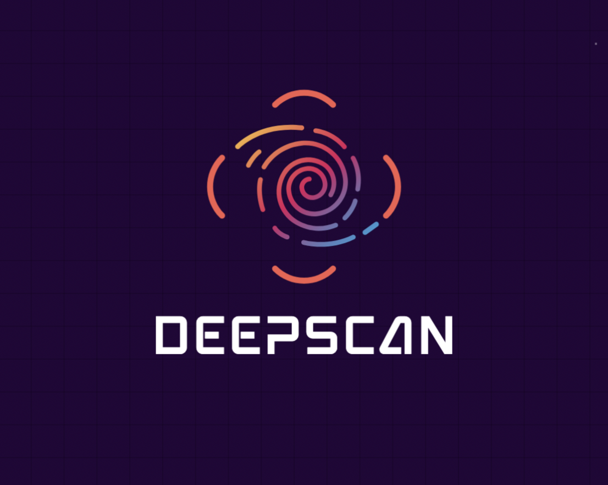

<a id="readme-top"></a>

<!-- PROJECT LOGO -->
<br />
<div align="center">
  <a href="#">
    
  </a>

  <h3 align="center">Malware Detection Web App</h3>

  <p align="center">
    Upload files or links to receive a real-time malware probability score.
    <br />
    <a href="#getting-started"><strong>Get Started »</strong></a>
    <br />
    <br />
    <a href="#usage">View Demo</a>
    &middot;
    <a href="#contact">Contact</a>
  </p>
</div>


<!-- TABLE OF CONTENTS -->
<details>
  <summary>Table of Contents</summary>
  <ol>
    <li>
      <a href="#about-the-project">About The Project</a>
      <ul>
        <li><a href="#built-with">Built With</a></li>
      </ul>
    </li>
    <li>
      <a href="#getting-started">Getting Started</a>
      <ul>
        <li><a href="#prerequisites">Prerequisites</a></li>
        <li><a href="#installation">Installation</a></li>
      </ul>
    </li>
    <li><a href="#usage">Usage</a></li>
    <li><a href="#roadmap">Roadmap</a></li>
    <li><a href="#contributing">Contributing</a></li>
    <li><a href="#contact">Contact</a></li>
  </ol>
</details>


<!-- ABOUT THE PROJECT -->
## About The Project

A full-stack malware detection web application built for a senior project. The app allows users to upload files or paste URLs and receive a prediction score of how likely the input is malicious. Powered by machine learning models trained on real malware datasets.

<p align="right">(<a href="#readme-top">back to top</a>)</p>


### Built With

* Flask
* scikit-learn
* pandas
* HTML/CSS/JavaScript 

<p align="right">(<a href="#readme-top">back to top</a>)</p>


<!-- GETTING STARTED -->
## Getting Started

To get a local copy up and running follow these simple steps.

### Prerequisites

* Python 3.7+
* pip

### Installation

1. Clone the repo
   ```sh
   git clone https://github.com/yourusername/malware-detector-app.git
   cd malware-detector-app
   ```
2. Create a virtual environment (optional but recommended)
   ```sh
   python -m venv venv
   source venv/bin/activate  # or venv\Scripts\activate on Windows
   ```
3. Install Python packages
   ```sh
   pip install -r requirements.txt
   ```
4. Run the Flask app
   ```sh
   python app.py
   ```
5. Open your browser at: `http://localhost:5000`

<p align="right">(<a href="#readme-top">back to top</a>)</p>


<!-- USAGE EXAMPLES -->
## Usage

- Paste a suspicious URL to get a predicted probability of malware
- Upload a file (e.g. APK or EXE) to analyze for malicious behavior
- View safe/malicious prediction labels and probabilities

<p align="right">(<a href="#readme-top">back to top</a>)</p>


<!-- ROADMAP -->
## Roadmap

- [x] Web + App data modeling
- [x] File & URL input UI
- [x] Flask backend API
- [x] Frontend polish and animations
- [x] Deploy on Render or Heroku
- [x] Add confidence intervals or explanations

<p align="right">(<a href="#readme-top">back to top</a>)</p>


<!-- CONTRIBUTING -->
## 🧑‍💻 Author(s)
Emri Nesimi:
Computer Science Major – NYIT
Class of 2025

Tanat Sahta:
Computer Science Major – NYIT
Class of 2025


## If you have suggestions or improvements, feel free to fork this repo and submit a pull request.

1. Fork the Project
2. Create a Feature Branch (`git checkout -b feature/feature-name`)
3. Commit Your Changes (`git commit -m 'Add feature'`)
4. Push to the Branch (`git push origin feature/feature-name`)
5. Open a Pull Request

<p align="right">(<a href="#readme-top">back to top</a>)</p>


<!-- CONTACT -->
## Contact

Emri Nesimi– [LinkedIn](https://www.linkedin.com/in/emri-nesimi-4740a526a/) – emrinesimi@yahoo.com
Tanat Sahta - LinkedIn: (https://www.linkedin.com/in/tanat-sahta-83933a214/) - sahta.tanat123@gmail.com


<p align="right">(<a href="#readme-top">back to top</a>)</p>
