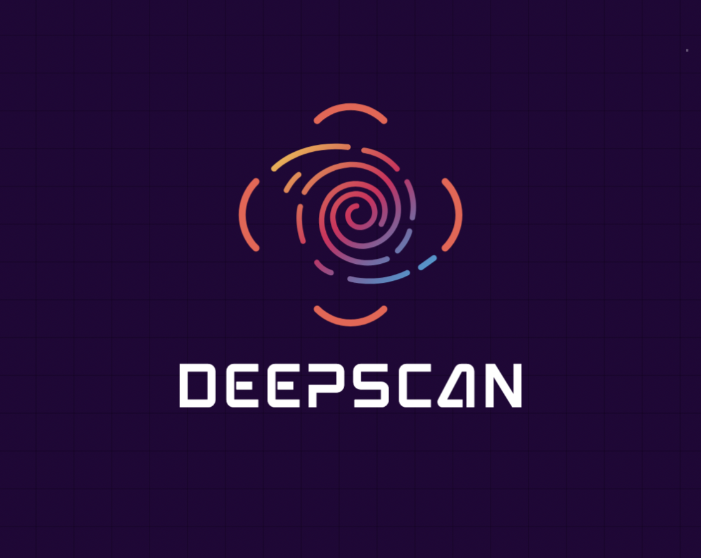

<a id="readme-top"></a>

<!-- PROJECT LOGO -->
<br />
<div align="center">
  <a href="#">
    
  </a>

  <h3 align="center">☣ MALWARE DETECTION WEB APP</h3>

  <p align="center">
    <b><code>Drop a file. Paste a link. Get a verdict.</code></b>
    <br />
    Real-time threat classification for URLs, documents, and Android packages.
    <br />
    <br />
    <a href="#-quick-start"><strong>Deploy the scanner »</strong></a>
    <br />
    <br />
    <a href="#-usage">View Demo</a>
    &middot;
    <a href="#-threat-taxonomy">Threat Taxonomy</a>
    &middot;
    <a href="#-contact">Contact</a>
  </p>

  <p align="center">
    
    
    
    
  </p>
</div>


<!-- TABLE OF CONTENTS -->
<details>
  <summary>Table of Contents</summary>
  <ol>
    <li>
      <a href="#-about-the-project">About The Project</a>
      <ul>
        <li><a href="#detection-engine">Detection Engine</a></li>
        <li><a href="#built-with">Built With</a></li>
      </ul>
    </li>
    <li><a href="#-threat-taxonomy">Threat Taxonomy</a></li>
    <li>
      <a href="#-quick-start">Quick Start</a>
      <ul>
        <li><a href="#prerequisites">Prerequisites</a></li>
        <li><a href="#installation">Installation</a></li>
      </ul>
    </li>
    <li><a href="#-usage">Usage</a></li>
    <li><a href="#-testing-with-eicar">Testing With EICAR</a></li>
    <li><a href="#-roadmap">Roadmap</a></li>
    <li><a href="#-security-notes">Security Notes</a></li>
    <li><a href="#-contributing">Contributing</a></li>
    <li><a href="#-authors">Authors</a></li>
    <li><a href="#-contact">Contact</a></li>
  </ol>
</details>


<!-- ABOUT THE PROJECT -->
## ☣ About The Project

A full-stack malware detection web app built as a senior project at NYIT.

Paste a suspicious URL or upload a file, and the scanner returns a threat
verdict in real time — no signature database, no local sandbox, no waiting.
Analysis runs through a large language model prompted as a security
specialist, which lets the scanner reason about *novel* inputs that a
signature-matching engine would wave straight through.

<p align="right">(<a href="#readme-top">back to top</a>)</p>


### Detection Engine

Two independent analysis paths feed a shared classifier:

```
   ┌─────────────┐        ┌──────────────────────┐        ┌──────────────┐
   │  URL input  │───────▶│  heuristic pre-check  │───────▶│              │
   └─────────────┘        │  (known CVE patterns) │        │   Gemini     │
                          └──────────────────────┘        │  1.5 Flash   │──▶ verdict
   ┌─────────────┐        ┌──────────────────────┐        │              │
   │ File upload │───────▶│  text extraction      │───────▶│  classifier  │
   │ PDF·TXT·APK │        │  PyPDF2 / zip parse   │        └──────────────┘
   └─────────────┘        └──────────────────────┘
```

**URLs** hit a fast heuristic layer first. Requests matching known Joomla
defacement patterns (`.php?option=com_content`, `.php?option=com_mailto`)
short-circuit to a `defacement` verdict without burning an API call —
everything else is classified by the model.

**Files** are unpacked to text before analysis. PDFs go through PyPDF2, plain
text is read directly, and APKs are cracked open as zip archives to pull
`AndroidManifest.xml` (falling back to base64 of the raw archive when the
manifest is unreadable). The extracted text is then screened for scam,
phishing, and social-engineering markers.

<p align="right">(<a href="#readme-top">back to top</a>)</p>


### Built With

* **Flask** — web server and routing
* **Google Gemini 1.5 Flash** — classification engine (`google-generativeai`)
* **PyPDF2** — PDF text extraction
* **python-dotenv** — API key management
* **HTML / CSS / JavaScript** — frontend

<p align="right">(<a href="#readme-top">back to top</a>)</p>


<!-- THREAT TAXONOMY -->
## 🧬 Threat Taxonomy

Every URL resolves to exactly one of four classes:

| Verdict | Flag | Meaning |
| :--- | :---: | :--- |
| `benign` | 🟢 SAFE | Normal, harmless site. No action needed. |
| `phishing` | 🔴 HARMFUL | Credential harvesting or impersonation attempt. |
| `malware` | 🔴 HARMFUL | Distributes malicious payloads. |
| `defacement` | 🔴 HARMFUL | Site appears compromised or defaced. |

File uploads resolve to a binary verdict — `Safe` when the content reads as
legitimate, `Harmful` with a short reason when it does not.

> [!NOTE]
> The scanner returns a **classification**, not a probability score. A verdict
> is the model's best judgment, not a calibrated confidence value — treat it as
> a strong signal, not proof.

<p align="right">(<a href="#readme-top">back to top</a>)</p>


<!-- GETTING STARTED -->
## 🔬 Quick Start

### Prerequisites

* Python 3.12 (3.7+ will likely work, but CI runs 3.12)
* pip
* A Google Gemini API key — free tier is plenty, grab one at
  [aistudio.google.com/apikey](https://aistudio.google.com/apikey)

### Installation

1. Clone the repo
   ```sh
   git clone https://github.com/EmriNesimi/SeniorProject.git
   cd SeniorProject
   ```
2. Create a virtual environment (optional but recommended)
   ```sh
   python -m venv venv
   source venv/bin/activate  # or venv\Scripts\activate on Windows
   ```
3. Install Python packages
   ```sh
   pip install -r requirements.txt
   ```
4. **Arm the scanner** — create a `.env` file in the project root:
   ```sh
   echo "GOOGLE_API_KEY=your_key_here" > .env
   ```
   > [!IMPORTANT]
   > `app.py` hard-fails on startup without this. `.env` is gitignored —
   > keep it that way, and never commit a real key.
5. Run the Flask app
   ```sh
   python app.py
   ```
6. Open your browser at `http://localhost:5000`

<p align="right">(<a href="#readme-top">back to top</a>)</p>


<!-- USAGE EXAMPLES -->
## 🖥 Usage

**Scan a URL** — paste any link into the URL field:

```
  ▸ SCAN TARGET   http://secure-login-verify.example.com/account
  ▸ CLASSIFIER    gemini-1.5-flash
  ────────────────────────────────────────────────────────────
  ▸ VERDICT       🔴 HARMFUL
  ▸ DETAIL        Likely a phishing attempt.
```

**Scan a file** — upload a `.pdf`, `.txt`, or `.apk`:

```
  ▸ SCAN TARGET   invoice_march.pdf
  ▸ EXTRACTED     2,431 chars via PyPDF2
  ────────────────────────────────────────────────────────────
  ▸ VERDICT       🟢 SAFE
  ▸ DETAIL        Content looks legitimate.
```

Anything outside `.pdf`, `.txt`, and `.apk` is rejected before analysis.

<p align="right">(<a href="#readme-top">back to top</a>)</p>


<!-- TESTING -->
## 🧪 Testing With EICAR

The repo ships two generators for the industry-standard
[EICAR test string](https://www.eicar.org/download-anti-malware-testfile/) — a
harmless 68-byte sequence every antivirus engine is expected to flag. Use them
to smoke-test the file pipeline without touching a live sample:

```sh
python generate_eicar_txt.py   # → eicar.txt
python generate_eicar_pdf.py   # → eicar.pdf  (requires reportlab)
```

Upload either file to the scanner and confirm it comes back flagged.

> [!WARNING]
> EICAR files are deliberately detectable and completely inert — they contain
> no malicious code. Your antivirus **will** still quarantine them on write.
> That is the point.

<p align="right">(<a href="#readme-top">back to top</a>)</p>


<!-- ROADMAP -->
## 🗺 Roadmap

- [x] Web + app data modeling
- [x] File & URL input UI
- [x] Flask backend API
- [x] Frontend polish and animations
- [x] Migrate classification to Gemini
- [x] EICAR test-file generators
- [x] CI pipeline
- [ ] Expand file support beyond PDF / TXT / APK
- [ ] Calibrated confidence scores alongside verdicts
- [ ] Scan history and result caching

<p align="right">(<a href="#readme-top">back to top</a>)</p>


<!-- SECURITY -->
## 🛡 Security Notes

A tool that handles hostile input deserves a few ground rules:

* **Never commit `.env`.** The key in it bills a real Google Cloud project.
  If one leaks, rotate it at
  [console.cloud.google.com/apis/credentials](https://console.cloud.google.com/apis/credentials)
  before anything else — deleting the file does not revoke the key.
* **Uploaded files are parsed, never executed.** APKs are read as zip
  archives and PDFs as text; nothing is run.
* **`debug=True` is for local development only.** The Werkzeug debugger
  exposes an interactive console — never expose it on a public host.
* **This is a research project, not a production AV.** Do not rely on it as
  your only line of defense.

<p align="right">(<a href="#readme-top">back to top</a>)</p>


<!-- CONTRIBUTING -->
## 🤝 Contributing

Suggestions and improvements are welcome — fork the repo and open a pull
request.

1. Fork the Project
2. Create a Feature Branch (`git checkout -b feature/feature-name`)
3. Commit Your Changes (`git commit -m 'Add feature'`)
4. Push to the Branch (`git push origin feature/feature-name`)
5. Open a Pull Request

<p align="right">(<a href="#readme-top">back to top</a>)</p>


<!-- AUTHORS -->
## 🧑‍💻 Authors

**Emri Nesimi** — Computer Science, NYIT, Class of 2025

**Tanat Sahta** — Computer Science, NYIT, Class of 2025

<p align="right">(<a href="#readme-top">back to top</a>)</p>


<!-- CONTACT -->
## 📡 Contact

Emri Nesimi — [LinkedIn](https://www.linkedin.com/in/emri-nesimi-4740a526a/) — emrinesimi@yahoo.com

Tanat Sahta — [LinkedIn](https://www.linkedin.com/in/tanat-sahta-83933a214/) — sahta.tanat123@gmail.com

<p align="right">(<a href="#readme-top">back to top</a>)</p>
